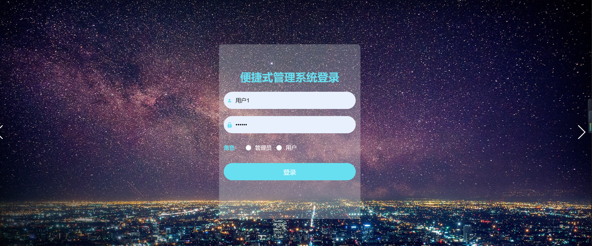
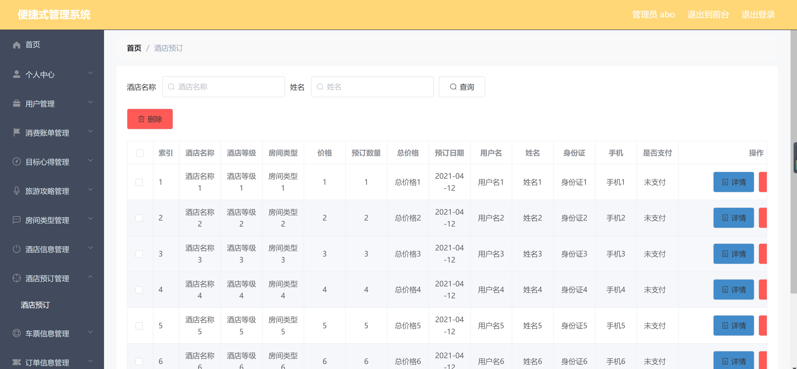

<h1 align="center">便捷旅游管理系统</h1>

## 简介
便捷旅游管理系统：角色分为管理员、用户；提供酒店预订、旅游攻略管理、用户管理、车票信息查询等多种功能，实现高效便捷的旅游信息和资源管理。    --计算机毕业设计源码；毕设源码；java毕业设计源码

## 联系方式

<h3 align="center">获取完整代码与数据库文件 + 微信：deepguan QQ: 86050149 QQ群: 783742310</h3>

<h3 align="center">可帮忙远程部署 包运行成功！提供远程部署、修改代码、设计文档指导、代码讲解等服务！</h3>

## 功能介绍（完整见运行截图）
管理员：基本功能包括系统登录、用户管理、酒店信息管理、房间类型管理、旅游攻略管理、车票信息管理和订单信息管理。管理员可以查看和编辑用户信息，包括用户名、姓名、性别、身份证、邮箱和手机号，还能管理消费账单和目标心得。酒店和旅游攻略模块允许管理员查看、修改、删除和查看评论等操作。经理拥有详细的系统后台管理功能，通过左侧导航栏访问各项管理功能。用户管理页面支持头像查看、修改和删除等操作。

用户：可以在系统中注册账号，并通过选择用户角色进行登录。用户可通过主界面查询和预订酒店，查看旅游攻略，搜索和制定旅行计划。一次性操作包括输入用户名、密码、身份证、邮箱和手机等信息。支持按酒店名称、姓名、景点名称或出发城市进行信息查询。用户可查看景点图像和旅游建议，并可以选择车票信息模块查看和选择交通工具。用户界面设计简洁，提供快速获取旅行资讯的途径，确保信息安全和隐私保护。

## 运行截图

本代码来源于网络,仅供学习参考使用!

